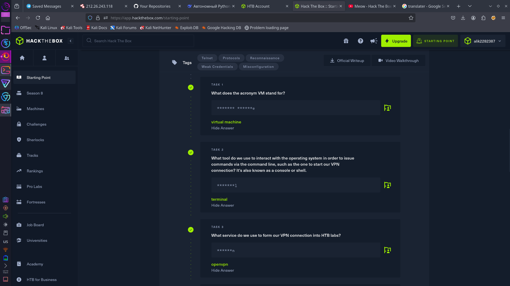
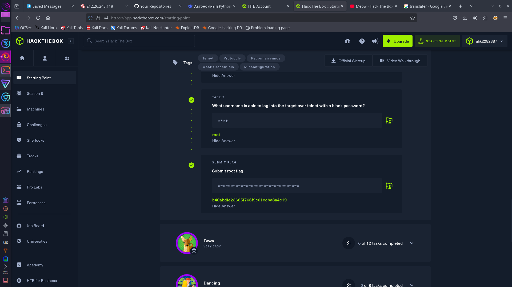

# 🐱 Hack The Box — Very Easy Machine: **Meow**

## 📘 О машине
Очень лёгкая машина в Hack The Box под названием **Meow**.  
Идеально подходит для самых первых шагов в этичном хакинге.

---

## ❓ Вопросы
Там немного вопросов, и они действительно простые — даже человек, который только начал свой путь, легко сможет на них ответить.

Внизу — скриншоты с вопросами и ответами:

### 🧩 Вопросы 1, 2, 3


### 🧩 Вопросы 4, 5, 6


### 🧩 Вопрос 7 и флаг


---

## 🎯 Как получить флаг

1. После запуска машины появится её IP-адрес.
2. Подключаемся по Telnet с помощью команды:

   ```bash
   telnet [IP-адрес]
3. логин root
4. получаем флаг cat flag.txt
